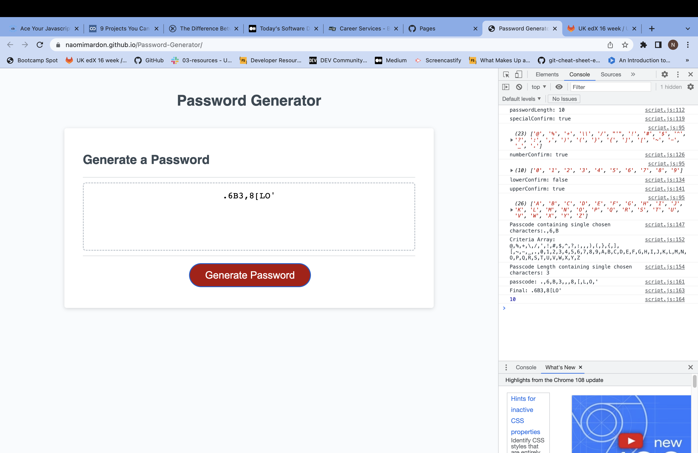

# Password-Generator
Randomly generates a password based on criteria selected by the user

## Description 

This application generates a random password based on the following criteria, selected by the user:
- length of the password, between 10 and 64 characters
- whether or not the password contains special characters, numbers, lower case letters or upper case letters.

The deployed application can be found at: 

https://naomimardon.github.io/Password-Generator/

## Usage 

Click the red button labelled 'Generate Password' and work through the prompts to determine the format of the password.

When selecting the length of the password, an invalid entry will return an error message. Click 'Generate Password' again to restart.

Here is a screenshot of the deployed application:

## Credits

With thanks to Patrick Meehan for tutorial support.

## License

Please refer to the license in the repo.

---
